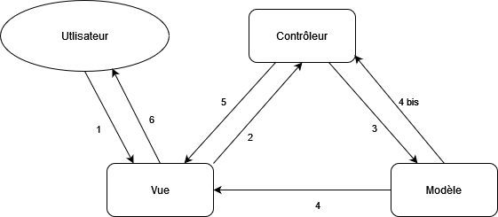
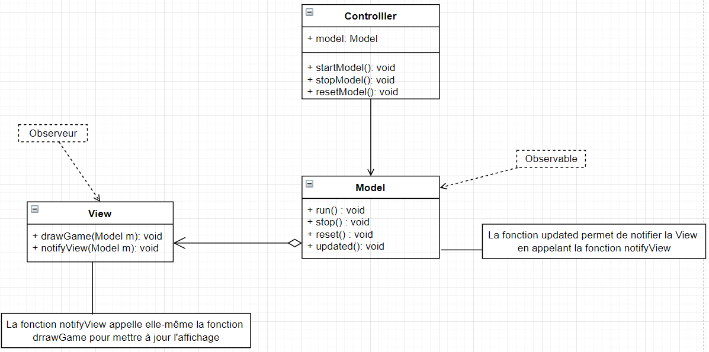

# ISI3 - MVC design pattern - "Game of Life"

> Le rapport est à fournir dans ce document sous chacune des questions.

> Ne copiez pas le code de votre voisin, ça se voit.

Nom/Prénom: `AHMED KHAN Somir, COUPPIE Louis`

Lien du codesandbox: `.......`

> Pour générer un codesandbox associé à votre code, [suivre cette doc](https://codesandbox.io/docs/importing#import-from-github).

Vous pouvez tester le code directement sur votre navigateur, à condition de lancer un serveur local. Par exemple :

```python3 -m http.server 8000```

Votre programme sera accessible depuis l'adresse `http://localhost:8000/index.html`.


## Game of Life

Le jeu de la vie est un automate cellulaire qui répond à des règles très simple.
Il a été inventé par [John Horton Conway](https://fr.wikipedia.org/wiki/John_Horton_Conway) (1937-2020).

## Avant-propos

1. Expliquer le design pattern MVC à l'aide d'un schéma à insérer directement ici.
Utiliser un outils comme Dia pour le représenter. Je veux **votre** schéma, pas un de ceux qu'on peut trouver sur le net.

Le design pattern MVC est un pattern permettant d'organiser le code en trois parties. 
Ces trois parties sont le Modèle, la Vue et le Contrôleur.



Explications des fleches du schéma :
- 1 : L'utilisateur agit uniquement avec la partie vue de l'application. Il n'a accès à aucune autre partie.
- 2 : Lorsque l'utilisateur interagit sur la vue, celle ci se traduit par une requête de la vue sur le contrôleur.
- 3 : Afin de répondre à cette requête, le contrôleur va lui échanger avec le modèle pour récupérer ou utiliser les données pour répondre à la requête initiale (requête de la vue).
- 4 : Après avoir reçu la requête du contrôleur, le modèle prépare les données nécessaires pour répondre à cette requête et renvoie le résultat directement à la vue.
- 4 bis et 5 : Cependant, il est possible que ce résultat ait besoin d'un traitement supplémentaire afin de répondre à la requête de la vue. Dans ce cas l'information repasseras par le contrôleur avant d'être transmise à la vue.
- 6 : L'utilisateur obtient la réponse à son action. 


2. Expliquer ce pattern en complétant ce texte.

Le pattern MVC, vise à découper le `modèle`, de la `vue` et du `contrôleur` afin de rendre le code plus `flexible`.
Les responsabilités ne sont alors plus `centralisé`.
On peut ainsi changer l'aspect visuel de son application sans pour autant impacter le `fonctionnement de l'application`.

3. Expliquer dans quels cas on doit privilégier le pattern MVC.

On privilégie le pattern MVC dans les applications ayant une interface graphique comme des sites internet. 
Cela permet de séparer l'application en deux parties, le front end et le back end avec notamment des Contrôleurs qui font le lien entre les deux. 
Cela permet de restreindre les accès de l'utilisateur à la partie front end et de cacher le traitement des données qui peuvent potentiellement contenir des informations sensibles. 
C'est là la principale utilité du modèle MVC : Scinder le projet pour maitriser les accès des différentes sections de celui-ci. 

## À faire (obligatoire)

- Rendre le jeu fonctionnel tout en respectant le design pattern MVC.
- Le bouton `start` doit lancer le jeu.
- Le bouton `stop` doit arrêter le jeu en l'état, le `start` relance le jeu.
- le bouton `reset` arrête le jeu et remet à la grille à l'état initial.

### Observer Observable

Afin de mettre à jour la vue à chaque nouvelle génération du jeu, la fonction `updated` doit notifier la view afin qu'elle se mette à jour.
Cela relève du design pattern Observer/Observable.

1. Expliquer votre implémentation:

L'usage d'un callback permet ici de `notifier` afin de dire à la _View_ de se redessiner.
L'objet _Model_ n'a pas de lien avec `View` pourtant grâce à la `fonction updated() dans le Model` il peut notifier la `View`.

2. Insérer ici un UML montrant le pattern Observer/Observable lié aux objets de ce TP.



## Optionnel

> Si vous voulez apprendre d'autres choses

- Faire en sorte de pouvoir changer les dimensions de la grille par un `<input/>` HTML.
- Faire en sorte de pouvoir modifier l'état d'une cellule en cliquant dessus.

## :warning: À rendre

- Une URL de codesandox pointant sur votre projet github afin que je puisse voir et tester le code.
- Le rapport complet.
